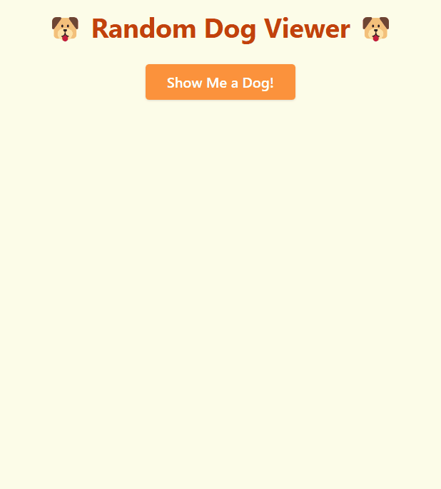

# Random Dog Viewer

A mini app that displays a random dog image every time you click the button. Built with HTML, Tailwind CSS, and JavaScript, this app fetches images from the free [Dog CEO API](https://dog.ceo/dog-api/) and updates the UI in real time.

Users can:
- Click a button to fetch a random dog image
- View high-resolution dog photos with a responsive layout

---

## Table of contents

- [Overview](#overview)
  - [Screenshot](#screenshot)
  - [Links](#links)
- [My Process](#my-process)
  - [Built With](#built-with)
  - [What I Learned](#what-i-learned)
- [Credits](#credits)
- [Author](#author)

---

## Overview

### Screenshot

Live demo of the dog viewer in action:

---

### Links

- [GitHub Repo](https://github.com/Lasse-Rodal/dog-viewer)
- [Live Demo](https://lasse-rodal.github.io/dog-viewer/)

---

## My Process

### Built With

- **Semantic HTML5**
- **Tailwind CSS** (CDN)
- **Vanilla JavaScript**
  - `async/await` and `fetch()`
  - Real-time API integration with Dog CEO API
  - Simple DOM manipulation and error handling

---

### What I Learned

In this project, I practiced:

- Making real-time API requests using `async/await`
- Updating the DOM based on dynamic API responses
- Building a lightweight but interactive app with Tailwind
- Improving feedback with basic error handling and fallback messages

---

## Credits

### API
- Dog images from the free [Dog CEO API](https://dog.ceo/dog-api/)

### Styling
- Layout styled with [Tailwind CSS](https://tailwindcss.com/)

---

## Author

- GitHub – [Lasse Rodal Pedersen](https://github.com/Lasse-Rodal)
